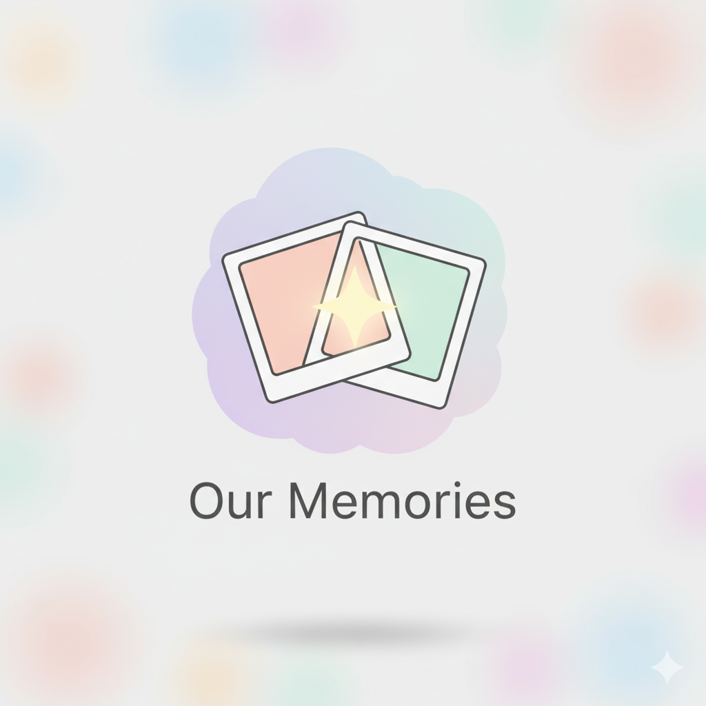
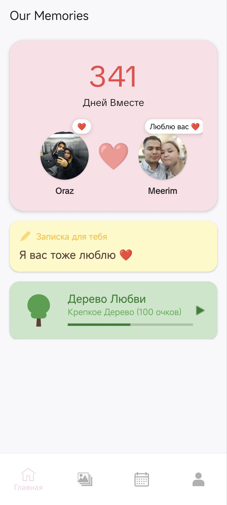
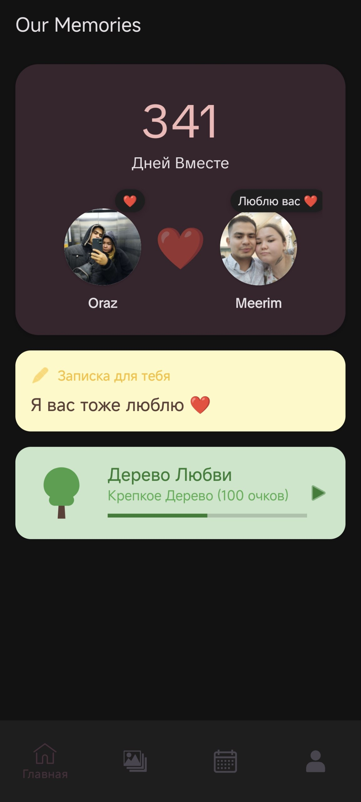
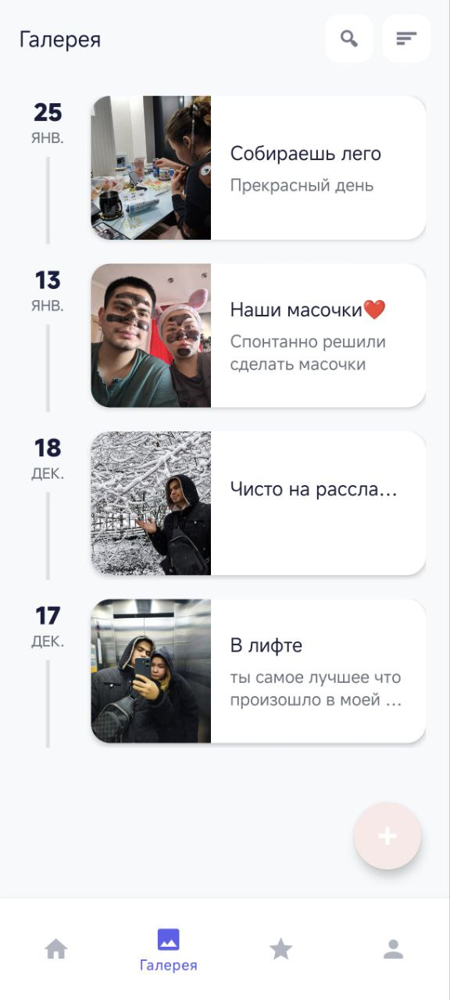
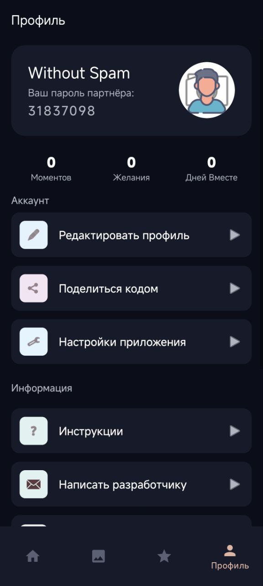
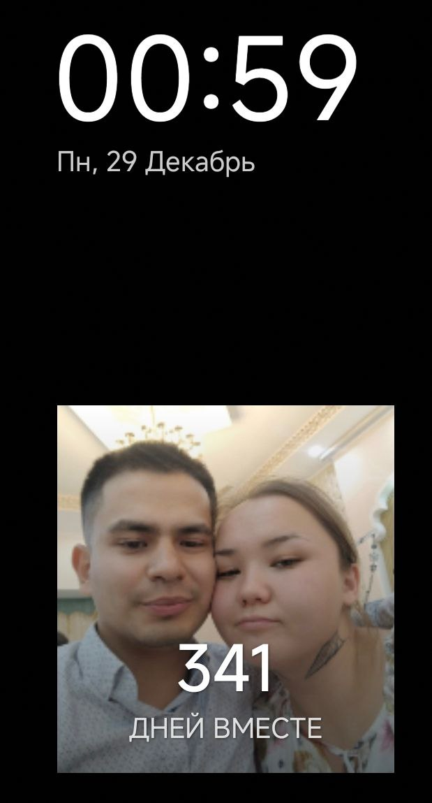
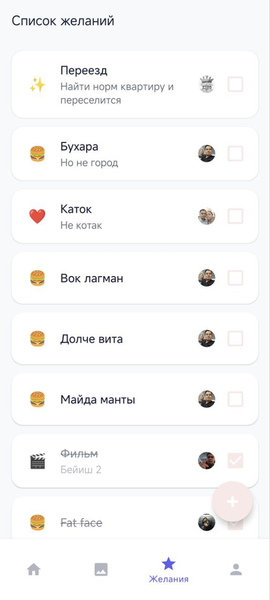
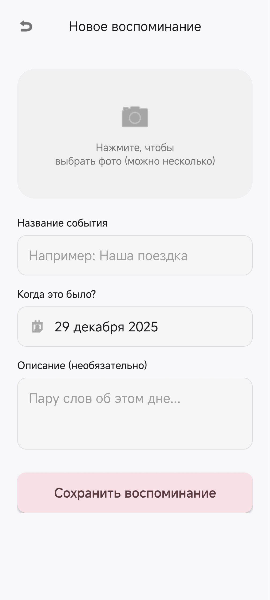
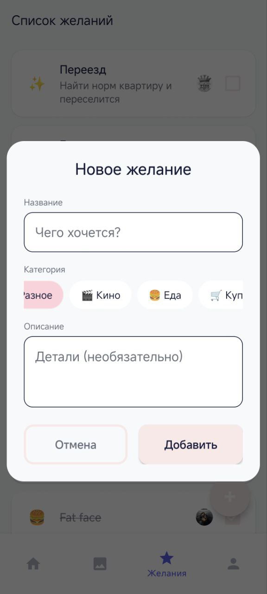

<!-- ЛОГОТИП -->

❤️ Our Memories

Уютное пространство для двоих

<i>Сохраняйте воспоминания, синхронизируйте желания и растите свою любовь.</i>

📖 О проекте

Our Memories — это уютное мобильное приложение для пар, помогающее сохранять воспоминания, синхронизировать желания и оставаться на связи, даже находясь на расстоянии.

Это личный цифровой уголок для двоих, где можно хранить фотографии, вести общие списки и следить за развитием отношений через игровые механики.

✨ Основные возможности

🏠 Главный экран (Hub)

Центр вашего цифрового дома. Здесь собрано всё самое важное:

❤️ Таймер отношений: Красивый счетчик дней, проведенных вместе.

💭 Живые статусы: Устанавливайте эмодзи-статус (😴, 💼, ❤️) или пишите свой текст, чтобы партнер знал, чем вы заняты.

📝 Записка на холодильнике: Общее текстовое поле, синхронизируемое в реальном времени. Оставляйте послания, напоминания или признания.

🌳 Дерево Любви (Тамагочи): Геймификация отношений!

Дерево растет, когда вы пользуетесь приложением.

10 стадий роста: от маленького ростка до величественного Древа Вечной Любви.

Поливайте дерево ежедневно и получайте бонусы за загрузку воспоминаний.

📸 Галерея Воспоминаний

Не просто хранилище фото, а история вашей жизни.

📁 Альбомы: Загружайте несколько фотографий за раз, создавая события.

📅 Умная дата: Приложение автоматически считывает дату съемки (EXIF) из первой фотографии.

🖼️ Обложки: Выбирайте лучшее фото, которое станет лицом альбома.

🔍 Поиск и Сортировка: Легко находите нужные моменты по названию или дате.

👁️ Просмотр: Полноэкранный просмотр с возможностью приближения (Zoom).

📝 Общий список желаний (Wishlist)

Место для ваших планов и мечт.

🔄 Синхронизация: Добавляйте фильмы, места для свиданий или список покупок — партнер увидит это мгновенно.

✅ Чек-боксы: Отмечайте выполненные желания (они автоматически перемещаются вниз списка).

⚡ Реальное время: Изменения видны обоим пользователям сразу.

📱 Виджет для рабочего стола

Любимый человек всегда рядом.

Показывает фото партнера и количество дней вместе прямо на экране телефона.

Offline-first: Работает даже без интернета, используя кэшированные данные.

Автоматически обновляется при смене данных.

* 👤 Профиль и Настройки

* 🌗 Темная тема: Полная поддержка Dark Mode, синхронизированная с системой.

* 🔗 Подключение партнера: Простая система связи через уникальный 8-значный код.

* 🔒 Безопасность: Данные хранятся в облаке и доступны только вашей паре.

* 🛠 Технический стек

Приложение написано с использованием современных технологий Android разработки:

Язык: Kotlin

Архитектура: Single Activity (Fragments), MVVM-like patterns

Backend (BaaS):

• Firebase

• Authentication: Вход через Email

• Firestore: База данных реального времени (NoSQL)

• Storage: Хранение фотографий и аватарок

• Cloud Functions: Серверная логика (Node.js)

• Cloud Messaging (FCM): Push-уведомления

Библиотеки:

• Glide: Загрузка и кэширование изображений

• PhotoView: Просмотр изображений с жестами зума

• Material Design Components: Современный UI/UX

🔔 Умные уведомления

* Приложение держит вас в курсе событий благодаря Cloud Functions (Node.js backend):

Событие: Новое фото

Уведомление: Партнер получает пуш: "Новое воспоминание! 📸"

Событие: Новое желание

Уведомление: "Новое желание! ✨"

Событие: Смена статуса

Уведомление: Узнайте, что партнер освободился: "Новый статус! 👀"

Событие: Записка

Уведомление: "Записка на холодильнике 📝" (защита от дубликатов для автора)

Событие: Связь

Уведомление при успешном соединении аккаунтов.

📱 Скриншоты

<table>
<tr>
<td align="center"><b>Главная (День)</b></td>
<td align="center"><b>Главная (Ночь)</b></td>
<td align="center"><b>Галерея</b></td>
</tr>
<tr>
<td></td>
<td></td>
<td></td>
</tr>
<tr>
<td align="center"><b>Профиль</b></td>
<td align="center"><b>Виджет</b></td>
<td align="center"><b>Список желаний</b></td>
</tr>
<tr>
<td></td>
<td></td>
<td></td>
</tr>
</table>

<table>
<tr>
<td align="center"><b>Добавление воспоминаний</b></td>
<td align="center"><b>Добавление желаний</b></td>
</tr>
<tr>
<td></td>
<td></td>
</tr>
</table>

🚀 Установка и запуск

1) Клонируйте репозиторий:

        git clone [https://github.com/Orazjan/Our-Memories.git](https://github.com/Orazjan/Our-Memories.git)

2) Откройте проект в Android Studio.

3) Подключите свой проект Firebase:

3) Создайте проект в Firebase Console.

4) Скачайте google-services.json.

5) Поместите его в папку app/ вашего проекта.

• Для работы уведомлений разверните Cloud Functions:

    cd functions
    npm install
    firebase deploy --only functions

Запуск:
Соберите и запустите приложение на устройстве!

🤝 Контакты

Если у вас есть идеи или предложения, пишите на orazjanov11@gmail.com.

<i>Сделано с любовью ❤️</i>

